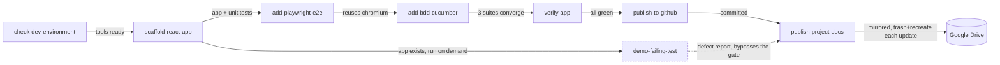

# Skills Flow
## How the 8 build skills fit together

**Author:** Muzaffer
**Date:** 2026-08-17
**Note:** Created using the Claude agent running in Windows Terminal (Claude Code CLI
on Windows 11). See also the interactive diagram: `docs/RUNBOOK.md` §7 links the same
content published as an Artifact.

---

Each phase of building, testing, and publishing SampleShop is captured as its own
Claude Code Skill under `.claude/skills/`. Seven run in sequence; one
(`demo-failing-test`) branches off and deliberately bypasses the quality gate.

## What each skill runs and leaves behind

| Skill | Runs | Leaves behind |
|---|---|---|
| `check-dev-environment` | winget installs for Node, Git, GitHub CLI; PATH refresh | A working terminal that can run npm / git / gh |
| `scaffold-react-app` | `npm create vite`, router + context wiring, Vitest suite | `src/`, `*.test.jsx` files |
| `add-playwright-e2e` | Installs Playwright + Chromium, writes `e2e/*.spec.js` | A real-browser test layer + the Chromium binary BDD reuses |
| `add-bdd-cucumber` | Cucumber.js scenarios in `bdd/features/*.feature` | Given/When/Then coverage with full parity to the other suites |
| `verify-app` | Unit + E2E + BDD suites, production build, manual browser pass | A pass/fail signal — the gate everything downstream trusts |
| `publish-to-github` | git init/commit, `gh auth login` (human clicks Authorize), push | The repo, live on GitHub |
| `publish-project-docs` | Writes/updates PRD, TDD, Test Plan, Test Cases, Test Run Report | `docs/*.md`, committed and pushed |
| `demo-failing-test` | One real, non-staged failing scenario in an isolated config | A defect report + its own Test Run Report — gate untouched |

## Reading the bypass path

`add-bdd-cucumber` literally reuses the Chromium browser that `add-playwright-e2e`
installs, rather than downloading its own — that's a real dependency, not just
ordering. `demo-failing-test` is the one skill that doesn't feed `verify-app`'s
pass/fail gate at all: it runs its scenario in an isolated config (see
`vite.demo.config.js`) so a deliberate or newly-discovered failure can't block a
release, then still lands its findings in the same documentation set via the dashed
path into `publish-project-docs`.

## Interactive version

The same diagram is also published as a Claude Artifact:
https://claude.ai/code/artifact/2f55c776-a023-441b-920d-6f83115fe1d2
